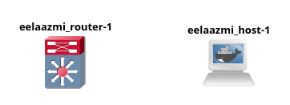
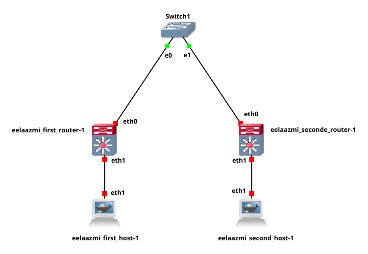
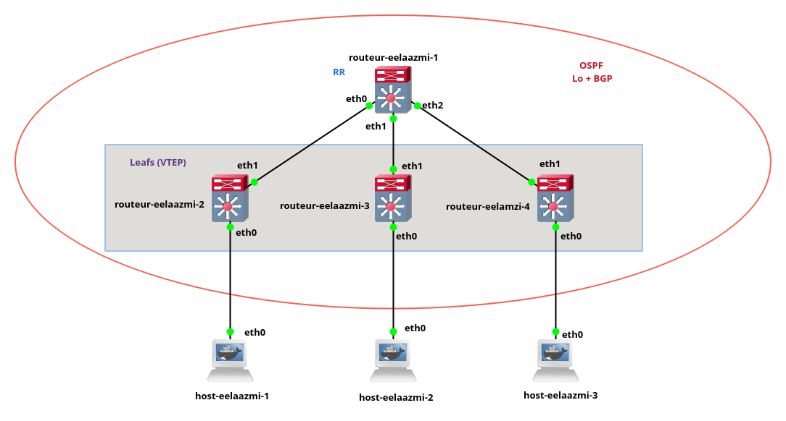

# BGP EVPN Network Simulation Project

## Overview

This project provides a comprehensive environment for simulating advanced networking concepts using GNS3, Docker, and a suite of configuration scripts. The focus is on Border Gateway Protocol (BGP), Ethernet VPN (EVPN), and related technologies, enabling users to build, configure, and experiment with modern network topologies in a reproducible manner.

## Network Topologies

The following diagrams illustrate the network topologies used in each part of the project:

### Part 1: Basic GNS3 + Docker Topology


### Part 2: VXLAN, Multi-Host, and Multi-Router Simulation


### Part 3: BGP EVPN and Spine-Leaf Architecture


## Objectives
- Demonstrate integration of Docker containers as network nodes in GNS3
- Simulate multi-host and multi-router environments with VXLAN tunneling
- Deploy and configure BGP EVPN in a spine-leaf data center architecture
- Provide automation scripts and configuration files for rapid setup and experimentation

## Directory Structure

```
Bgp-At-Doors-for-Autonomous-Systems/
├── p1/         # Part 1: Basic GNS3 + Docker topology
├── p2/         # Part 2: VXLAN, multiple hosts/routers
│   └── images/
│       ├── hosts/   # Host configs and setup scripts
│       └── routers/ # Router configs and setup scripts
├── p3/         # Part 3: BGP EVPN, Dockerized spine-leaf
│   └── images/ # Dockerfiles and Makefile for custom images
├── Network_Layers.md, Ressource.md, Readme.md, ...
```

## Prerequisites
- GNS3 (with Docker integration enabled)
- Docker
- Make (for automation)
- Bash shell
- (Optional) PDF viewer for documentation

## Setup and Usage

### Part 1: Basic GNS3 + Docker Topology
1. Open `p1/p1.gns3project` in GNS3.
2. Use the provided `Makefile` and `entrypoint.sh` to set up the topology.
3. Reference `topology.png` for the network diagram.

### Part 2: VXLAN, Multi-Host, and Multi-Router Simulation
1. Open `p2/p2.gns3project` in GNS3.
2. Build and configure hosts and routers using scripts in `p2/images/hosts/` and `p2/images/routers/`.
   - Example: `bash setup_first_host.sh` to configure the first host.
3. Use the `Makefile` for batch setup.
4. Reference `topology.png` for the network diagram.

### Part 3: BGP EVPN and Spine-Leaf Architecture
1. Open `p3/P3.gns3project` in GNS3.
2. Build Docker images using the `Makefile` in `p3/images/`.
3. Use scripts such as `evpn.sh`, `leaf_vtysh.sh`, `spine_vtysh.sh`, and `p3_host.sh` to configure the network.
4. Reference `topology.png` for the advanced network diagram.

## Detailed Part Descriptions

### Part 1: Basic GNS3 + Docker Integration
- **Purpose:** Introduces the use of Docker containers as network nodes within GNS3.
- **Key Files:**
  - `entrypoint.sh`: Initializes the simulation environment.
  - `eelaazmi-1.daemons.conf`: Daemon/service configuration for routing protocols.
  - `Makefile`: Automates setup tasks.
- **Outcome:** Users learn to launch and configure a simple network with Dockerized nodes.

### Part 2: VXLAN and Multi-Node Simulation
- **Purpose:** Simulates a network with multiple hosts and routers, utilizing VXLAN for Layer 2 over Layer 3 tunneling.
- **Key Files:**
  - `setup_first_host.sh`, `setup_second_host.sh`: Configure host nodes.
  - `setup_router_1.sh`, `setup_router_2.sh`: Configure router nodes.
  - `eelaazmi_host-1`, `eelaazmi_host-2`: Host configuration files.
  - `eelaazmi_router-1`, `eelaazmi_router-2`: Router configuration files.
  - `Makefile`: Automates setup for hosts and routers.
- **Outcome:** Users automate the setup of complex topologies and implement VXLAN tunneling.

### Part 3: BGP EVPN and Spine-Leaf Architecture
- **Purpose:** Deploys a scalable data center topology using BGP EVPN and Docker-based network nodes.
- **Key Files:**
  - `Dockerfile.host`, `Dockerfile.routeur`: Build instructions for host and router containers.
  - `evpn.sh`: Configures EVPN settings.
  - `leaf_vtysh.sh`, `spine_vtysh.sh`: Configure leaf and spine routers.
  - `p3_host.sh`: Host configuration script.
  - `Makefile`: Automates Docker image builds and setup.
- **Outcome:** Users build custom Docker images, configure BGP EVPN, and simulate advanced topologies.

## Key File and Script Descriptions
- **.gns3project**: Defines the network topology for GNS3.
- **Makefile**: Automates building images and running setup scripts.
- **entrypoint.sh / setup_*.sh**: Shell scripts to initialize and configure nodes.
- **Dockerfile.host / Dockerfile.routeur**: Docker build instructions for hosts and routers.
- **eelaazmi-1.daemons.conf**: Daemon/service configuration for routing protocols.
- **topology.png**: Visual diagram of the network for each part.

## Extending and Customizing the Project
- Add new hosts or routers by duplicating and modifying existing configuration files and scripts.
- Create new Dockerfiles for custom network appliances as needed.
- Modify GNS3 project files to experiment with different topologies or protocols.
- Use the provided Makefiles to automate repetitive or batch tasks.

## References
- [GNS3 Documentation](https://docs.gns3.com/)
- [Docker Documentation](https://docs.docker.com/)
- [BGP EVPN Overview (Cisco)](https://www.cisco.com/c/en/us/td/docs/iosxr/ncs5500/vxlan/63x/b-vxlan-cg-ncs5500-63x/b-vxlan-cg-ncs5500-63x_chapter_0100.html)

---

For questions, issues, or contributions, please open an issue or submit a pull request on the project repository.
